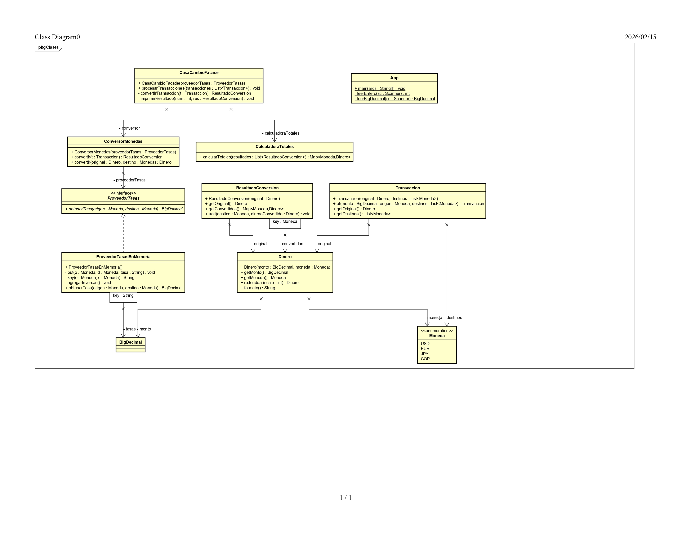
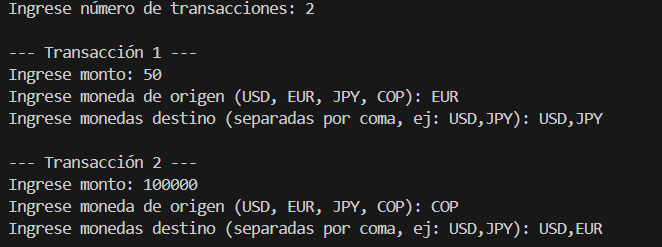
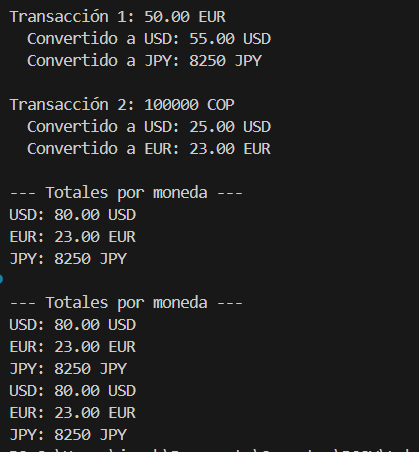

# 💵🏦 Reto #4 – La Estafa de la Casa de Cambio

### 👥 Integrantes del grupo
- **Kevin Segura**
- **Juan David Vélez**
- **Juan Bogotá**

## Descripción

Este proyecto simula el funcionamiento de una casa de cambio que permite convertir cualquier moneda entre USD, EUR, JPY y COP utilizando tasas reales.
El sistema permite que el usuario ingrese múltiples transacciones desde consola.
Cada transacción puede convertir un monto desde una moneda origen hacia una o varias monedas destino.

Al finalizar, el sistema muestra: el monto original, cada conversión realizada y el total acumulado por moneda utilizando Streams.

El proyecto fue desarrollado en Java utilizando Maven.

---

## 🧩 Patrón de Diseño Utilizado

### Patrón empleado

**Facade**

---

### Categoría

Estructural

---

### ¿Por qué se utilizó este patrón?

Se utilizó el patrón **Facade** porque el sistema requiere coordinar varias responsabilidades internas como: obtener tasas de cambio, convertir montos entre monedas, manejar múltiples transacciones y calcular totales usando Streams.

El patrón Facade permite ocultar toda la complejidad interna del sistema y exponer una interfaz sencilla a través de la clase CasaCambioFacade.

De esta manera: App solo interactúa con la fachada, la fachada coordina el conversor, el proveedor de tasas y la calculadora de totales, se mantiene bajo acoplamiento entre las clases, el sistema es más organizado y fácil de mantener.

Este diseño permite que si en el futuro cambian las tasas o la lógica de conversión, no sea necesario modificar la clase principal, es decir, respeta el principio O.

---

### Modelo UML y Evidencias

